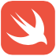

# iOS Development School at Fast Campus

## About

 based on 

I started studying iOS development based on Swift as a 6th School's member at Fast Campus. The school name is 'iOS Development School'. This school started at 8th of January in 2018. In this repository, there are lesson contents and code samples related to them. You can see the core codes for each lesson, which are helpful for swift coding and iOS development as well, and some simple application views can be found here with how to make them.

## Lessons

1. [Git](./Lessons_Learning/git.md)
2. [Variable](./Lessons_Learning/variable.md)
3. [Function](./Lessons_Learning/function.md)
4. [Condition](./Lessons_Learning/condition.md)
5. [Loop](./Lessons_Learning/loop.md)
6. [Collection Type](./Lessons_Learning/collection_type)
7. [Class / Struct](./Lessons_Learning/class_struct.md)
8. [Optional](./Lessons_Learning/optional.md)
9. [Property / Access Modifier](./Lessons_Learning/property_access_modifier.md)
10. [UI](./Lessons_Learning/ui.md)
11. [Application Life Cycle](./Lessons_Learning/application_life_cycle.md)
12. [View Controller](./Lessons_Learning/view_controller.md)

## contact
> Email: clyksb0731@gmail.com
